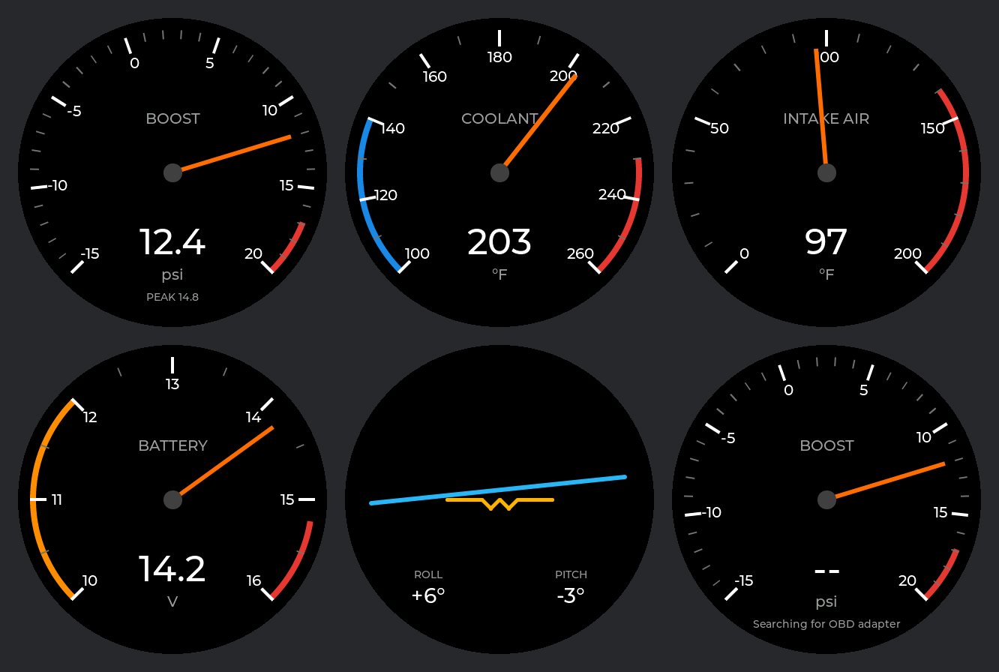

# Outback Gauge

A round gauge pod for a 2025 Subaru Outback 2.4 turbo, built on the Waveshare
ESP32-S3-Touch-LCD-1.46B. It reads live engine data from a Bluetooth LE OBD-II
adapter and adds a tilt meter from the board's motion sensor.



## Hardware

- **Waveshare ESP32-S3-Touch-LCD-1.46B**: ESP32-S3R8, 412×412 round SPD2010 display, QMI8658 IMU
- **BLE OBD-II adapter**: OBDLink CX recommended; any ELM327-compatible adapter that
  speaks **Bluetooth LE** should work (the ESP32-S3 can't do classic Bluetooth)
- USB-C power from the car. The LiPo connector works, but hot cars are hard on LiPos.

## Pages

Short-press **BOOT** to cycle pages; the current page is remembered across reboots.

| Page | Source | Hold BOOT |
|---|---|---|
| Boost (psi, vacuum below 0) | PID 0x0B manifold pressure minus PID 0x33 baro | Reset peak |
| Coolant (°F) | PID 0x05 | |
| Intake air (°F) | PID 0x0F | |
| Battery (V) | `ATRV`, measured by the adapter; works with the engine off | |
| Tilt (roll/pitch) | QMI8658 accelerometer | Set current attitude as level |

The page on screen gets polled as fast as the adapter answers. Everything else
is polled in rotation every 400 ms. Warning thresholds are in `src/config.h`.

## Build and flash

Uses the same PlatformIO platform as `sensecap-camera-viewer` (pioarduino,
Arduino core 3.1.0).

```bash
pio run -e outback_gauge -t upload
```

Bench test without the car or adapter (fake but plausible data):

```bash
pio run -e outback_gauge_sim -t upload
```

If an upload won't start, hold BOOT while plugging in USB.

Serial output (`pio device monitor`) logs the adapter it finds, its banner,
which BLE service it picked, and battery voltage every 10 s.

## Preview the UI on a Mac

`tools/preview/build.sh` compiles `src/ui.cpp` and LVGL with clang and renders
every page to `docs/preview.png`, so layout changes can be checked without
flashing. Run `pio run` once first so LVGL is downloaded.

## How it works

- `src/display.cpp`: Arduino_GFX drives the SPD2010 over QSPI (pins from
  Arduino_GFX's own `WAVESHARE_ESP32_S3_LCD_1_46` definition). LVGL renders
  into a full-frame canvas in PSRAM that is pushed whole, which sidesteps the
  SPD2010's x-alignment rules for partial writes.
- `src/obd.cpp`: scans for an adapter whose name matches `OBD_NAME_HINTS`,
  picks the first non-standard GATT service with a notify and a write
  characteristic (UUIDs differ by brand), then speaks ELM327:
  `ATE0 ATL0 ATS0 ATH0 ATAT1 ATSP6`, falling back to `ATSP0`. Requests use the
  reply-count suffix (`010B1`) so the adapter answers without waiting out its
  timeout. Runs on its own task on core 0.
- `src/imu.cpp`: roll and pitch are measured against a saved reference, so the
  mount angle and the chip's orientation on the board don't matter. Assumes an
  upright mount (vent or dash face), not flat on the console.
- `src/board.cpp`: power latch (GPIO7), TCA9554 expander for the panel and
  touch resets, backlight PWM (GPIO5), battery ADC (GPIO8, ×3 divider).

## Still to verify on hardware

- **Screen orientation**: set `DISPLAY_ROTATE_180` in `src/config.h` if it's upside down.
- **Tilt direction**: flip `TILT_ROLL_SIGN` / `TILT_PITCH_SIGN` if it leans the wrong way.
- **OBDLink CX pairing**: assumed to need no PIN or bonding. If it connects
  but never answers, it may need BLE security enabled.
- **IMU address**: probes 0x6B then 0x6A.

## Next

- Touch input (the SPD2010 touch controller needs its own driver; BOOT is used for now)
- Subaru CVT fluid temperature (mode 22 request to the transmission module; the PID needs finding)
- Overheat alarm on the speaker (PCM5101 over I2S)
