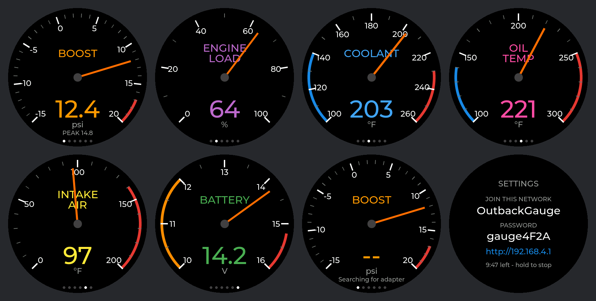

# Outback Gauge

A round gauge pod for a 2025 Subaru Outback 2.4 turbo, built on the Waveshare
ESP32-S3-Touch-LCD-1.46B. It reads live engine data from a Bluetooth LE OBD-II
adapter.



## Hardware

- **Waveshare ESP32-S3-Touch-LCD-1.46B**: ESP32-S3R8, 412×412 round SPD2010 display
- **BLE OBD-II adapter**: OBDLink CX recommended; any ELM327-compatible adapter that
  speaks **Bluetooth LE** should work (the ESP32-S3 can't do classic Bluetooth)
- USB-C power from the car's console port. No battery: a hot parked car is hard on LiPos.
- **Case**: printable two-piece case and a console-tray mount in
  [`tools/case`](tools/case/README.md), for the widened-cover-glass version of the board.

## Pages

The gauges cycle on their own every 3 seconds (adjustable, or off, on the
settings page). **Tap** to go to the next one early. The dots along the bottom show where you are, and the current page is
remembered across reboots. The BOOT button does the same from the bench — a
short press moves to the next page, holding it acts like a long press — but
it has no hole in the case: it sits under one of the magnet pads. Everything
it does is also a touch gesture.

| Page | Source |
|---|---|
| Boost (psi, vacuum below 0) | PID 0x0B manifold pressure minus PID 0x33 baro |
| Coolant (°F) | PID 0x05 |
| Intake air (°F) | PID 0x0F |
| Battery (V) | `ATRV`, measured by the adapter; works with the engine off |

**Press and hold** on any of these opens the Wi-Fi settings page and starts the
access point. Hold on that page to stop it and go back. It isn't in the
rotation.

The page on screen gets polled as fast as the adapter answers. Everything else
is polled in rotation every 400 ms.

## Settings over Wi-Fi

Warning thresholds, backlight and the auto-rotate timing are edited from a web
page the gauge serves itself, so retuning them doesn't need a reflash.

Press and hold on any gauge. The gauge brings up an access
point and shows its name, password and address on screen; join it from a phone
and the form should open on its own, or go to `http://192.168.4.1`. Saved values
live in NVS and survive a reboot.

The access point is deliberately not always on. Wi-Fi and BLE share the one
2.4 GHz radio, so leaving it up would cost the OBD link latency every drive for
no benefit. It shuts itself off ten minutes after the last request; a long press
stops it sooner.

Everything applies the moment you save except rotating the picture, which LVGL
only reads when the display driver is registered, so the page offers a reboot
button for that one. `src/config.h` still holds all of these values, but they
are now the factory defaults a never-configured gauge starts with — once you
save, the saved copy wins until you hit "Restore defaults".

## Build and flash

Uses the same PlatformIO platform as `sensecap-camera-viewer` (pioarduino,
Arduino core 3.1.0).

```bash
pio run -e outback_gauge -t upload
```

Bench test without the car or adapter (fake but plausible data):

```bash
pio run -e outback_gauge_sim -t upload
```

Just the settings page, on any ESP32-S3 with Wi-Fi — a SenseCAP Indicator, a
bare devkit — with no display, touch or BLE compiled in. Lets the form be
used and debugged before the gauge hardware exists; every save comes back out
over serial:

```bash
pio run -e webconfig_probe -t upload && pio device monitor
```

If an upload won't start, hold BOOT while plugging in USB.

Serial output (`pio device monitor`) logs the adapter it finds, its banner,
which BLE service it picked, and battery voltage every 10 s.

Attach the monitor *before* resetting if you want the boot lines. The USB-C
port is the S3's native USB, so the host has not enumerated it yet when
`setup()` runs and everything it prints — the expander and touch
addresses — is gone before anything is listening. A plain power-up gets you
nothing until the first `[BAT]` line ten seconds later.

## Preview the UI on a Mac

`tools/preview/build.sh` compiles `src/ui.cpp` and LVGL with clang and renders
every page to `docs/preview.png`, so layout changes can be checked without
flashing. Run `pio run` once first so LVGL is downloaded.

`tools/webpreview/build.sh` does the same for the settings form: it compiles the
real `src/webpage.cpp` and writes `docs/settings-page.html` to open in a browser.
Needs no LVGL and no board.

## Test gesture detection on a Mac

`src/gesture.h` has no hardware dependencies, so tap and long-press
detection can be checked with simulated finger movements:

```bash
clang++ -std=c++17 -Isrc tools/gesture-test/gesture_test.cpp -o /tmp/gesture_test && /tmp/gesture_test
```

## How it works

- `src/display.cpp`: Arduino_GFX drives the SPD2010 over QSPI (pins from
  Arduino_GFX's own `WAVESHARE_ESP32_S3_LCD_1_46` definition). LVGL renders
  into a full-frame canvas in PSRAM that is pushed whole, which sidesteps the
  SPD2010's x-alignment rules for partial writes.
- `src/obd.cpp`: scans for an adapter whose name matches `OBD_NAME_HINTS`,
  picks the first non-standard GATT service with a notify and a write
  characteristic (UUIDs differ by brand), then speaks ELM327:
  `ATE0 ATL0 ATS0 ATH0 ATAT1 ATSP6`, falling back to `ATSP0`. Requests use the
  reply-count suffix (`010B1`) so the adapter answers without waiting out its
  timeout. Runs on its own task on core 0.
- `src/touch.cpp`: SPD2010 touch controller at I2C 0x53, ported from
  Espressif's `esp_lcd_touch_spd2010`. The controller boots into a BIOS state
  and each poll walks it toward point-reporting mode, then reads the first
  finger. `src/gesture.h` turns those reports into taps and long presses.
- `src/board.cpp`: power latch (GPIO7), TCA9554 expander for the panel and
  touch resets, backlight PWM (GPIO5), battery ADC (GPIO8, ×3 divider).
- `src/settings.cpp`: the runtime copy of everything the web page can change,
  stored in NVS as one versioned blob. The web server runs on its own task, so
  it stages a whole struct and the UI task swaps it in between frames rather
  than editing fields underneath a running redraw.
- `src/webconfig.cpp`: the access point, a captive-portal DNS responder and the
  HTTP server, all on a task of their own. Request handling is a far deeper call
  path than anything else here; sharing the loop stack with it is what corrupted
  the display in `sensecap-camera-viewer`. Stopping the AP also drops the Wi-Fi
  stack so its RAM goes back to BLE and LVGL.
- `src/webpage.cpp`: the form's markup, split from the server so the Mac
  renderer can build it.

## Hardware status

Confirmed on the board. Every guess in `src/config.h` turned out right, so
the mount and touch mapping are fixed:

- **Expander**: TCA9554 answers at 0x20, and the panel and touch resets work.
- **Touch**: present and reporting at boot. Taps land where they should.
- **Screen orientation**: right way up with `DISPLAY_MOUNT_DEG` 270.
- **Settings Wi-Fi**: the access point comes up and the form saves, with BLE
  running on the same radio — the one thing the bench build couldn't prove.

Still open:

- **OBDLink CX pairing**: assumed to need no PIN or bonding. If it connects
  but never answers, it may need BLE security enabled. Not tried in the car yet,
  so it is the only part of this that is still a guess.

## Next

- Subaru CVT fluid temperature (mode 22 request to the transmission module; the PID needs finding)
- Overheat alarm on the speaker (PCM5101 over I2S)
