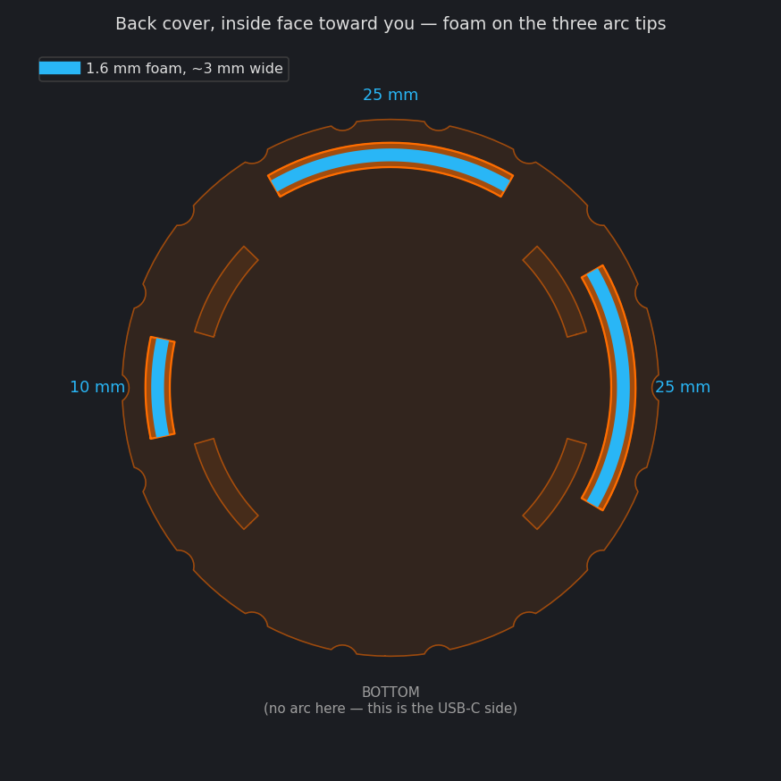
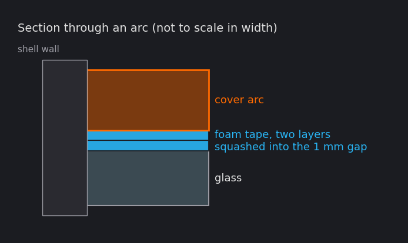
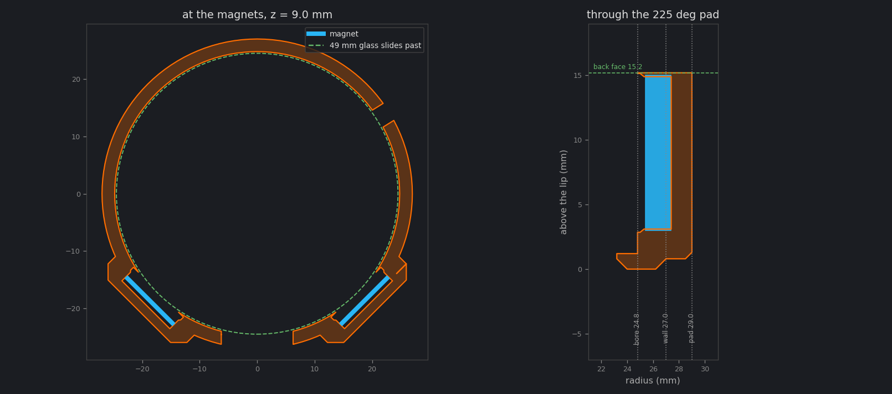

# Case

A two-piece round case for the ESP32-S3-Touch-LCD-1.46B **with widened
protective cover glass** (49 mm glass). The other glass versions need
different numbers at the top of `case.py`.

The gauge lives in the console tray under the screen: a printed sled drops
into the tray's well and two arms hold the case upright on magnets, so
nothing is stuck to the car and the tray still lifts out.

| File | What it is | From |
|---|---|---|
| `stl/case_front` | Shell that holds the glass, with blind magnet pockets in two raised pads at 225° and 315° and the bayonet grooves for the back | `case.py` |
| `stl/case_back_slim` | Back cover: three bayonet lugs, no magnet pockets | `sled.py` |
| `stl/sled` | Tray sled with the two cradle arms | `sled.py` |
| `stl/magnet_test` | Test pockets for dialling in the magnet press fit | `magnet_test.py` |

Each part is written as both `.3mf` and `.stl`. Load the **3MF** if your
slicer offers the choice: it states millimeters, so nothing can import at the
wrong scale.

The case is 54.0 mm across and 18.4 mm deep with the slim back. The glass
sits behind a 1.3 mm lip that covers only the black border.

## The twist joint

The back cover has no screws. Three lugs on its pusher arcs drop into
channels cut through the shell's back face, and an 18° twist takes them into
grooves whose roofs ramp down 0.7 mm, pulling the cover forward onto the
foam. A ramped bump near the end of each groove is the detent: it takes a
push to turn past and then holds against the car's vibration, and the end of
the groove is the stop. The lugs are at 0°, 90° and 180°, so the cover only
lines up one way round. Scallops around the cover's rim are there to grip.

Being a first cut, the fit is the part most likely to need a tweak. If it
won't turn, raise `BAY_FIT`; if it turns but rocks, raise `BAY_PRELOAD`; if
it takes two hands to get past the detent, lower `DETENT`. Each is one
number at the top of `case.py` and a reprint of the one part.

`BAYONET = False` puts the old joint back: three M2×4 screws through the
wall into the arcs. Both parts have to be regenerated together — a bayonet
shell will not take a screw cover.

In the sled, the gauge stands square with its bottom edge 5 mm above the sled
(2 mm above its top face), its face flush with the sled's front, and its
screen center 32 mm above the sled's underside. The USB-C port points **left** (`USB_DEG` in `case.py`), out of the
side of the case well clear of the arms, and the cable runs back to the dash
port. It is turned a quarter from the board's natural bottom-edge position
because the screen is polarized: with the port down, the picture goes black
through polarized sunglasses.

## Printing

- **PETG or ASA, not PLA.** PLA softens around 60 °C and a parked car gets hotter.
  At a print service, MJF nylon (PA12) is also a good choice.
- 0.2 mm layers, 3+ walls, 20–30% infill, **no supports**. Print the front
  shell lip-down and the back cover outside-face-down (arcs pointing up).
  The files are already in these orientations.
- The groove roofs and the undersides of the lugs are ~1 mm unsupported
  ledges. They print, but expect a little droop; if the twist is stiff at
  first, run a knife around them once.
- Print the front shell alone first and check the glass fit before printing the back.

## Hardware

- No screws: the back cover twists on. (With `BAYONET = False`, 3 × M2×4
  self-tapping pan-head screws instead.)
- 4 × N52 12×2 mm disc magnets. **No glue** — each is pressed into an
  11.80 mm seat and held by the plastic. Peel any adhesive off the backs; it
  only gets in the way. The shell's two load from inside and vanish behind a
  closed pad; the arms' two stop 0.5 mm behind the pad face.
- Soft 1/16" (1.6 mm) closed-cell foam weatherstrip, a few cm. It needs to be
  thicker than the 1 mm gap so it squashes and takes up tolerance; dense 1 mm
  mounting tape is too firm.

## Assembly

1. Set the four magnets into the shell and the arms (see [Magnet mounting](#magnet-mounting)).
2. Cut three strips of the foam about 3 mm wide and stick one on the **tip**
   of each arc — the end face that points forward, not the arc's inner or
   outer side. Two are about 25 mm long and one about 10 mm, and the short
   strip goes on the short arc. The left of the cover has no arc at all,
   which is how you tell which way round it is: that gap faces the USB-C
   notch. (The picture below predates the quarter turn and shows the gap at
   the bottom.)

   

   
3. Drop the board into the front shell from behind, glass first, turning it
   so the USB-C port lines up with the notch on the left. Neither side
   button gets a hole — see [Buttons](#buttons).
4. Line the three lugs up with the three channels in the shell's back face —
   only one rotation fits — press the cover in against the foam, and twist it
   clockwise (seen from the back) about 18° until it clicks past the detents
   and stops.

## Buttons

Neither side button gets a hole, and the two LEDs by the USB-C port are
sealed in.

**BOOT** was meant to have one. It sits 7° from the 315° magnet pad, which at
that radius is 3.2 mm — inside the pocket's 5.95 mm — so its slot broke into
the magnet seat and notched the wall that grips the disc, and the pad filled
the outer end of the slot back in regardless. Everything BOOT does (short
press for the next page, hold for the page action) is also a touch gesture.

**PWR** latches the LiPo power path, and this build has no battery on purpose.

Both are reachable with the case off, which is where bench work happens. To
put a hole back, set `BUTTON_SLOTS` in `case.py` to `(PWR_DEG,)` or
`(PWR_DEG, BOOT_DEG)`; the angles and the slot size are still measured there.

Neither LED is under software control — there is no LED pin on this board.
One is the 5 V power indicator; the other belongs to the charger, and
Waveshare call its state indeterminate with no battery connected, so whatever
it is doing here means nothing. Sealing them in is no loss: a power light
glowing inside a gauge pod at night is a nuisance.

## Magnet mounting

Four magnets in four pockets: two in the shell's side wall at 225° and 315°,
two facing them in the sled's arms. Nothing is stuck to the car, and nothing
is glued.

**The shell's two sit in pads that stand 2 mm proud of the wall**, and they
load from inside the shell, before the board goes in. There is no opening in
the outside at all — the disc bottoms against the back of the pad, under
1.6 mm of plastic. Plastic and air are the same to a magnet, so closing the
old recess costs nothing in pull.

The material has to go outward because none of it can come from the inside:
the 49 mm glass slides the whole length of the bore on its way to the lip, so
anything reaching in stands in its way. The pads are at 45° off the bottom
rather than 30° for the same kind of reason — at 240°/300° they fouled the
USB-C plug's path and pushed the case out to 56 mm across. At 225°/315° they
clear the plug by 11 mm and stay inside the 54 mm circle.

A flat pad face also keeps the cap an even 1.6 mm. On the curved wall it
would have been a lens: 1.6 mm at the middle of the pocket and 0.53 mm at its
tangential edges, which is one extrusion and may not print at all.

Each pocket is a loose bore that necks down to an interference seat, with a
cone between them. The disc goes in easily for the first millimetre and is
then pressed the last 2 mm into the seat, where the plastic grips it.
Superglue does not hold these — cyanoacrylate gets no grip on the nickel
plating — so the plastic does the work instead.

The interference is in the bore diameter, not in a lip or a collar. A ledge
inside a bore that is thinner than one extrusion width does not get printed
at all, which is a good way to produce a pocket that looks right on screen
and holds nothing.

**Print `magnet_test` first.** How a bore comes out varies by printer by more
than the fit tolerance, so a guess costs an hour of shell. The coupon has
six pockets bored sideways, the way the real ones print, at 12.30, 12.20,
12.10, 12.00, 11.90 and 11.80 mm, with 1 to 6 ticks above them. Press a magnet
into each, keep the tightest one that goes in without a fight, and put its
seat into `MAGNET_PRESS`.

Both parts are on 11.80 mm, 6 ticks, and that is confirmed in a printed
shell rather than only on the coupon. If a disc will not start, it is worth
a second go with a drift before reaching for the next size up — the first
shell printed at this seat felt too tight and turned out not to be.



1. Snap the magnets together in two pairs so each pair attracts, and mark the
   outward face of each with a pen. Get a pair backwards and the gauge pushes
   itself off the cradle.
2. Peel any adhesive off the backs.
3. Start each disc square in its pocket, marked face out, and press it in
   with something flat — a coin, a socket, the back of a screwdriver. It
   takes a firm push and then goes. Don't hammer it: N52 is brittle and
   chips.
4. The shell's two go in **from inside, before the board**, and are pushed
   outward until they stop against the back of the pad. Use a drift that
   fits down a 12 mm bore — a 10 mm socket, a bolt head, a dowel — not a
   flat block. In the arms the disc stops 0.5 mm behind the pad face.
5. If one won't start, a few turns of sandpaper wrapped round a pen opens the
   seat. If one drops straight in, lower `MAGNET_PRESS` and reprint that
   part.

The gauge then drops into the cradle and the two magnets pull it against the
pads. The arms carry its weight in the V between them; the magnets only stop
it lifting out and rattling.

## Adjusting the fit

Everything is set by the constants at the top of `case.py`:

- Glass loose or tight in the shell: `FIT` (radial clearance, default 0.3 mm, sized for MJF nylon; 0.2 suits a well-tuned FDM printer)
- Board rattles even with foam, or the cover won't close: `FOAM` (default 1.0 mm)
- USB-C plug won't reach: `USB_OPENING`
- Want a button hole back: `BUTTON_SLOTS`, with `PWR_DEG`, `BOOT_DEG`, `BUTTON_Z`
- Twist joint too tight, too loose, or the detent too stiff: `BAY_FIT`,
  `BAY_PRELOAD`, `DETENT`; back to screws with `BAYONET = False`
- Different magnets: `MAGNET_D`, `MAGNET_T`, `MAGNET_X`
- Gauge too hard or too easy to lift off the cradle: `MAGNET_STANDOFF` (bigger
  is weaker). Two N52 12×2 pairs in contact would be several kilos, enough to
  pull an arm off the sled; the ~2 mm gap is deliberate
- Magnets drop into their pockets, or won't press in: `MAGNET_PRESS`, the
  radius of the seat relative to the disc. Print `magnet_test` to find it
- Plastic left over the shell's magnets: `SIDE_CAP` (1.6 mm, even, on a flat
  pad face). Thicker is a stronger cap and a weaker hold
- How far the pads stand out, and so how far the arms sit back:
  `SIDE_PAD_H`. Raising it needs a matching reprint of the sled
- Gauge height, arm size and the tray well: the constants at the top of `sled.py`

Regenerate after a change. The script checks the case against an outline of
the board and the USB-C plug path, and fails if anything collides.

```bash
python3 -m venv tools/case/.venv
tools/case/.venv/bin/pip install -r tools/case/requirements.txt
tools/case/.venv/bin/python tools/case/case.py
```

Board positions were measured from Waveshare's dimension drawing for this
version, so treat the first print as a test fit.
